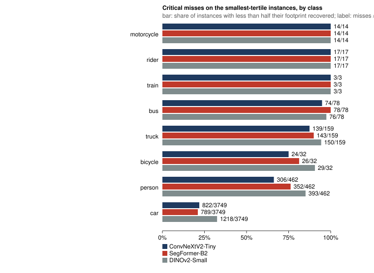
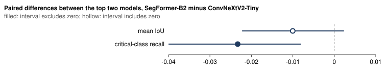
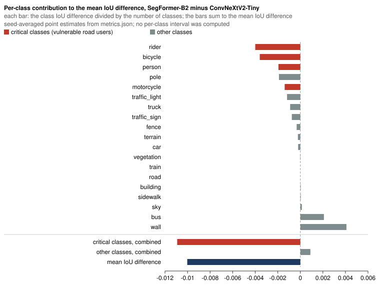
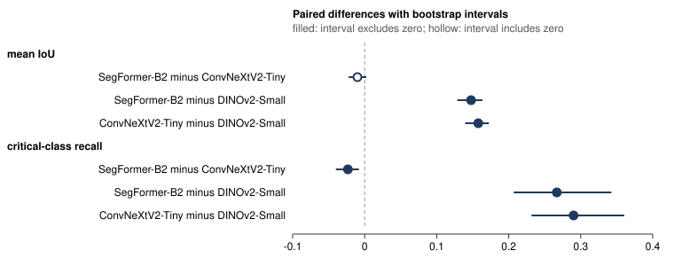

# driving-risk-metrics

**Which vulnerable-road-user segmentation failures does mIoU leave out?**

[繁體中文](README.md) · [Live report](https://kuotunyu.github.io/driving-risk-metrics/) · [Release v1.0.2](https://github.com/kuotunyu/driving-risk-metrics/releases/tag/v1.0.2)

Part of a three-project autonomous-driving perception-safety portfolio with [bev-calibration-lab](https://github.com/kuotunyu/bev-calibration-lab) ([site](https://kuotunyu.github.io/bev-calibration-lab/)), camera–LiDAR calibration faults on nuScenes, and [perception-error-to-aeb](https://github.com/kuotunyu/perception-error-to-aeb) ([site](https://kuotunyu.github.io/perception-error-to-aeb/)), perception errors fed into a fixed AEB policy on nuPlan.
The projects use different datasets and study settings and do not form a validated perception-to-AEB pipeline.

Three contemporary semantic segmentation models were trained on BDD100K under one
frozen protocol, three seeds each, and evaluated once on a locked 998-image cohort
that was never used for training, checkpoint selection, temperature fitting or
sample selection. The three accuracy metrics give the same model order, while their
paired bootstrap intervals provide different strength of evidence for separating the
top two. The confidence-based metrics mostly favour SegFormer-B2, second on mean
IoU, as point estimates without intervals. This repository also reports
instance-level failures hidden by pixel averages.

## At a glance

- Top two models on mean IoU, SegFormer-B2 minus UperNet-ConvNeXtV2-Tiny: -0.010, paired bootstrap interval -0.022 to 0.002, which includes zero. <!-- claim: p1.interval.miou.segformer-minus-convnextv2; rounded: 3; fields: estimate,low,high -->
- The same two models on critical-class recall, which covers the vulnerable-road-user classes: -0.023, interval -0.040 to -0.008, which excludes zero. <!-- claim: p1.interval.critical-recall.segformer-minus-convnextv2; rounded: 3; fields: estimate,low,high -->
- UperNet-ConvNeXtV2-Tiny recovers less than half the pixels of 306 of the 462 smallest-tertile person instances. <!-- claim: p1.instances.convnextv2.person-small -->
- The same model recovers less than half the pixels of every one of the 17 smallest-tertile rider instances. <!-- claim: p1.instances.convnextv2.rider-small -->
- The same model recovers less than half the pixels of 822 of the 3749 smallest-tertile car instances. <!-- claim: p1.instances.convnextv2.car-small -->

Instance counts come from one training seed per model (seed 17, the first of the three
approved seeds, after temperature scaling, which does not change the predicted class);
they are not averaged over seeds and carry no interval. This is an exception to the
mean-over-seeds rule in [`docs/protocol.md`](docs/protocol.md). Rider and motorcycle have
too few smallest-tertile instances to estimate a failure rate; the person counts support
a more stable within-cohort description.
A pre-registered post-release analysis later added the other two seeds and intervals, from the
same released predictions: seed 17 is representative, every model critically misses most
smallest-tertile people, and the three models are separable on them. See
[the all-seed analysis](docs/posthoc/allseed-v1/results.md).

A pixel-averaged score can look healthy while most of the smallest pedestrians and every
smallest rider in this cohort are critically missed. The figure shows every instance class
for all three models: car, by far the most frequent, is the only class in which most
smallest-tertile instances are recovered, so the failure is not unique to vulnerable road
users.



How much of this comes from downscaling the input at inference? A pre-registered post-release
analysis on the calibration split re-ran inference at native resolution without retraining: two
of the three models recover a small share of the small people, most are still missed, and all
three miss more large people. See [the resolution analysis](docs/posthoc/resolution-v1/results.md).
It uses different images, so its numbers are not comparable with this page.

## The finding

The paired bootstrap interval for the two best models **includes zero on mean IoU**, while
the same comparison on recall over the vulnerable-road-user classes **excludes zero**.



<details>
<summary>Full-precision statements</summary>

> The paired difference in mean IoU between SegFormer-B2 and UperNet-ConvNeXtV2-Tiny is -0.010027276977824351, and its bootstrap interval from -0.02224922437284147 to 0.0023369779504553204 includes zero. <!-- claim: p1.interval.miou.segformer-minus-convnextv2 -->

> The paired difference in critical-class recall between SegFormer-B2 and UperNet-ConvNeXtV2-Tiny is -0.023304517439508565, and its bootstrap interval from -0.03998178645924999 to -0.008046430169669789 excludes zero. <!-- claim: p1.interval.critical-recall.segformer-minus-convnextv2 -->

</details>

A mean IoU interval that includes zero does not establish equivalence or
interchangeability; comparing these intervals is also not a direct test of a
difference between the metrics. These are segmentation measurements, not tests of
braking decisions or real-world safety.

The figure below splits the same mean IoU difference by class. Mean IoU gives each of the
nineteen classes equal weight, so the vulnerable-road-user gap reaches it diluted: the four
highlighted classes together account for more than the whole difference. The bars are
seed-averaged point estimates from `metrics.json` with no per-class interval, and the mean
IoU interval itself includes zero.
[`tests/contract/test_committed_figures.py`](tests/contract/test_committed_figures.py)
redraws every figure from the evidence and checks this decomposition on the released metrics.



Under the three accuracy metrics the order of the three models does not change, and
that is reported as plainly as a reversal would have been:

> Ranking the three models by critical_recall produces the same order as ranking them by miou: no reversal is observed. <!-- claim: p1.ranking.critical-recall.no-reversal -->
> Ranking the three models by pixel_accuracy produces the same order as ranking them by miou: no reversal is observed. <!-- claim: p1.ranking.pixel-accuracy.no-reversal -->

What changes between these metrics is not the order but how strongly this cohort's
bootstrap interval supports separating the top two.

The project's question in [`docs/protocol.md`](docs/protocol.md) also covers
confidence-based metrics such as calibration and selective risk, and on these the
mean IoU order of the top two mostly does not hold.
Selective risk (AURC) and the Brier score favour SegFormer-B2 over
UperNet-ConvNeXtV2-Tiny with or without temperature scaling, the calibrated Brier
score only marginally; ECE favours SegFormer-B2 before temperature scaling and
UperNet-ConvNeXtV2-Tiny after it. These are seed means without intervals, so they
show a direction, not a separation. The values are in the
[Selective risk](https://kuotunyu.github.io/driving-risk-metrics/#selective-risk) and
[Calibration](https://kuotunyu.github.io/driving-risk-metrics/#calibration) sections
of the live report.



## Headline results

Averaged over three seeds on the locked cohort. The headline table uses three decimal
places and an explicit marker that makes the claims validator recompute each displayed
value from its artifact. The exact values remain available immediately below.

| Model | mean IoU | critical-class recall | pixel accuracy |
| --- | --- | --- | --- |
| UperNet-ConvNeXtV2-Tiny <!-- claim: p1.metrics.convnextv2; rounded: 3; fields: miou,critical_recall,pixel_accuracy --> | 0.632 | 0.811 | 0.939 |
| SegFormer-B2 <!-- claim: p1.metrics.segformer; rounded: 3; fields: miou,critical_recall,pixel_accuracy --> | 0.622 | 0.787 | 0.939 |
| UperNet-DINOv2-Small <!-- claim: p1.metrics.dinov2; rounded: 3; fields: miou,critical_recall,pixel_accuracy --> | 0.474 | 0.520 | 0.914 |

<details>
<summary>Full precision and evidence trace</summary>

| Model | mean IoU | critical-class recall | pixel accuracy |
| --- | --- | --- | --- |
| UperNet-ConvNeXtV2-Tiny <!-- claim: p1.metrics.convnextv2 --> | 0.6320100232208011 | 0.8105162716623479 | 0.9387763736063249 |
| SegFormer-B2 <!-- claim: p1.metrics.segformer --> | 0.6219827462429768 | 0.7872117542228393 | 0.9385890837416806 |
| UperNet-DINOv2-Small <!-- claim: p1.metrics.dinov2 --> | 0.47424706184502113 | 0.520379600009604 | 0.9141344038041649 |

</details>

> Every paired interval is a two-stage paired bootstrap over summed confusions at 0.95 confidence, using 5000 resamples from seed 20260831. <!-- claim: p1.interval.method -->

## Where the pixel metrics hide the failure

Pixel-weighted metrics let one bus outvote fifty pedestrians. This repository also
scores every annotated instance with equal weight, and calls an instance a
**critical miss** when less than half of it is classified correctly. Instances are
grouped into size tertiles learned from the training split alone.

Every instance count in this section comes from seed 17 of each model after temperature
scaling, not from a mean over seeds, and carries no interval. The critical-miss figure is under
[At a glance](#at-a-glance).

These results cover only smallest-tertile instances in the locked cohort whose
semantic and instance annotations corroborate each other. The 462 person instances
support a more stable within-cohort description; rider and motorcycle have only 17
and 14 instances, so their extreme failures merit inspection but cannot estimate a
failure rate for other data or deployment conditions:

> UperNet-ConvNeXtV2-Tiny recovers less than half the pixels of 306 of the 462 smallest-tertile person instances. <!-- claim: p1.instances.convnextv2.person-small -->
> UperNet-ConvNeXtV2-Tiny recovers less than half the pixels of every one of the 17 smallest-tertile rider instances. <!-- claim: p1.instances.convnextv2.rider-small -->
> UperNet-ConvNeXtV2-Tiny recovers less than half the pixels of every one of the 14 smallest-tertile motorcycle instances. <!-- claim: p1.instances.convnextv2.motorcycle-small -->

Against cars, the same model on the same instances:

> UperNet-ConvNeXtV2-Tiny recovers less than half the pixels of 822 of the 3749 smallest-tertile car instances. <!-- claim: p1.instances.convnextv2.car-small -->
> Across all classes UperNet-ConvNeXtV2-Tiny misses more than half the pixels of 1399 of the 4514 smallest-tertile instances. <!-- claim: p1.instances.convnextv2.small-overall -->

This contrast shows that one model's overall pixel average does not describe how
failures are distributed across classes and instance sizes. It is not a measurement
of real-world risk or safety.

Instance coverage is measured over the footprint that the semantic and instance
annotations corroborate, not over the raw bitmask, because the two annotations
disagree at object boundaries and scoring over pixels only one of them claims would
attribute an annotation artefact to the model:

> Instance coverage scores 12860 instances over the footprint that the semantic and instance annotations corroborate, a mean corroborated fraction of 0.94643690780947; 115 instances had no corroborated pixel and were excluded. <!-- claim: p1.instances.corroboration -->
> Every one of the 998 locked-cohort ground-truth masks was verified against the frozen manifest before it was scored. <!-- claim: p1.ground-truth.masks -->

## Calibration does not always help

Temperature scaling is fitted on a held-out calibration split and applied to the
locked cohort. The expected calibration error (ECE) here is classwise: for each class, pixels
are grouped by their predicted probability for that class into fifteen equal-width
bins; each bin contributes the gap between its mean predicted probability and how
often the class actually occurs in it, weighted by the bin's share of pixels; and the
per-class errors are averaged over all nineteen classes. It is not comparable in size
with the top-label ECE usually reported. [`docs/protocol.md`](docs/protocol.md) gives
the full definition. Temperature scaling lowered this error for two models and raised
it for the third:

> Temperature scaling lowered the expected calibration error of UperNet-ConvNeXtV2-Tiny on the locked cohort, from 0.004609387187919981 to 0.0032855195799122. <!-- claim: p1.calibration.convnextv2.ece -->
> Temperature scaling lowered the expected calibration error of UperNet-DINOv2-Small on the locked cohort, from 0.005448051902032049 to 0.003985369701553616. <!-- claim: p1.calibration.dinov2.ece -->
> Temperature scaling raised the expected calibration error of SegFormer-B2 on the locked cohort, from 0.0028840449773854925 to 0.0035196866015977167. <!-- claim: p1.calibration.segformer.ece -->

All three executions moved in the same direction. The per-seed values make this
consistency visible:

> Every SegFormer-B2 seed moved the same way after temperature scaling: calibrated 0.003590665043061051, 0.0034857099631801494, 0.0034826847985519496 against uncalibrated 0.0028459279224686924, 0.002904871031420072, 0.0029013359782677135. <!-- claim: p1.calibration.segformer.ece-per-seed -->

In this experiment, temperature scaling fitted on the calibration cohort increased
locked-cohort ECE for a model whose ECE was already low. The per-seed values
complement the mean; this observation does not generalize to all models or datasets.
The Brier score of SegFormer-B2 moved the same way, rising after temperature scaling
in every seed, while it fell for the other two models.

## Thin classes are labelled, not hidden

> All three models score an IoU of 0.0 on the class train, which carries 109005 labelled pixels in 7 of the cohort's images. <!-- claim: p1.per-class.train -->

Read alone, a zero looks like a model failure. Read beside its support it is a
statement about the cohort. Every per-class row in the generated report carries its
pixel count and its image count, and a class appearing in fewer than 50 images is
marked thin.

Accuracy also varies by where in the frame a road user appears:

> Pixel accuracy in the middle third of the image, where distant road users appear, is 0.9063993962745598 for UperNet-ConvNeXtV2-Tiny, 0.9039825378430191 for SegFormer-B2, 0.8681091984773754 for UperNet-DINOv2-Small. <!-- claim: p1.bands.middle -->

In the top and bottom bands SegFormer-B2 is marginally ahead of
UperNet-ConvNeXtV2-Tiny; all band values are seed means without intervals, in
[`extended-metrics.json`](docs/evidence/bdd100k_semseg_v1/extended-metrics.json).

These bands are normalized image rows. They are not depth and not metric distance.

## How every number on this page is checked

Each result sentence above carries a <code>&lt;!-- claim: ... --&gt;</code> marker. The claim names an
artifact under [`docs/evidence/bdd100k_semseg_v1/`](docs/evidence/bdd100k_semseg_v1),
a JSON pointer inside it, and the protocol and dataset manifest hashes the artifact
must carry. Two independent checks enforce it; both commands are listed under
[Check every published number](#check-every-published-number-cpu-only-no-dataset-no-gpu).

The first, `audit-claims`, proves every registry claim reproduces from its own artifact.
The second, `validate_claims.py`, reads both READMEs and the release notes, traces every
marked sentence, and **reports any line that states a metric and a number without a
marker**. A number nobody can trace is the
failure this project exists to prevent, so an untraceable one fails the build rather
than shipping. The same check runs inside the test suite
([`tests/contract/test_published_documents.py`](tests/contract/test_published_documents.py)),
so a pull request that adds an untraced number fails its CI check.

The evidence is also self-checking inside the ordinary test run: a change to any
published number, in any tracked artifact, fails the test suite.

Research record:

- [`docs/protocol.md`](docs/protocol.md) — the frozen protocol and its revisions.
- [`docs/experiment-card.md`](docs/experiment-card.md) — the nine runs, their hashes and the method history.
- [`docs/model-card.md`](docs/model-card.md) — the three architectures and their permitted use.
- [`docs/dataset-card.md`](docs/dataset-card.md) — BDD100K provenance, licence and the frozen splits.
- [`docs/related-work.md`](docs/related-work.md) — the published work these methods follow or depart from, including Cityscapes iIoU, temperature scaling and risk–coverage analysis.

Engineering and release records:

- [`docs/verification/analysis-reproduction.md`](docs/verification/analysis-reproduction.md) — three independent executions of the analysis, and what agreed.
- [`docs/verification/mutation-audit.md`](docs/verification/mutation-audit.md) — the mutation score of the pure core and every surviving mutant's disposition.
- [`docs/release-notes/`](docs/release-notes) — what each release changed.

## Reproducing this

Requires uv 0.11.x: `pyproject.toml` requires `>=0.11.18,<0.12`, so uv 0.12 and later
refuse to run, and CI uses 0.11.18. Install it with `pipx install uv==0.11.18` or the
versioned installer ([install.sh](https://astral.sh/uv/0.11.18/install.sh), or
[install.ps1](https://astral.sh/uv/0.11.18/install.ps1) on Windows).

### Check every published number (CPU only, no dataset, no GPU)

These are the commands the Pages workflow runs before it publishes the report:

```bash
uv sync --frozen --all-groups
uv run --frozen driving-risk audit-claims --claims docs/claims.yaml
uv run --frozen python .agents/skills/auditing-driving-risk-claims/scripts/validate_claims.py \
  --claims docs/claims.yaml --repo-root . --document README.md --document README.en.md \
  --document docs/release-notes/v1.0.0.md --document docs/release-notes/v1.0.1.md \
  --document docs/release-notes/v1.0.2.md
uv run --frozen driving-risk report --claims docs/claims.yaml --artifacts-dir docs/evidence/bdd100k_semseg_v1 --output-dir site
```

In a fresh copy on a Windows machine without a GPU, the three commands after the sync took
under ten seconds. The first sync downloads the locked packages, so its time depends on the
network.

### Full development gate

```bash
uv sync --frozen --all-groups --extra train --extra report
uv run --frozen python -m drivemetrics.dev verify
uv run --frozen driving-risk --help
```

`verify` runs eight stages in a fixed order and stops at the first failure: the
private-file guard, format check, lint, type check, the full test suite, 100 percent
statement and branch coverage on first-party code, schema contracts, and
documentation links. There are no coverage exemptions, no `pragma: no cover`
comments and no omitted first-party paths.

### Formal pipeline (needs BDD100K and a GPU)

The formal pipeline, in order:

```bash
driving-risk data preflight --config configs/protocols/bdd100k_semseg_v1.yaml --data-root PATH --output PATH
driving-risk data tertiles --manifest PATH --labels-root PATH --instance-root PATH --output PATH
driving-risk train --config configs/run_segformer_b2.yaml --manifest PATH --data-root PATH --seed 17 --output-dir PATH --device cuda
driving-risk calibrate --config configs/protocols/bdd100k_semseg_v1.yaml --manifest PATH --checkpoint PATH --data-root PATH --output-dir PATH --device cuda
driving-risk evaluate --config configs/protocols/bdd100k_semseg_v1.yaml --manifest PATH --checkpoint PATH --data-root PATH --output-dir PATH --device cuda --temperature PATH
driving-risk index --runs-root PATH --config configs/protocols/bdd100k_semseg_v1.yaml --manifest PATH --risk-profile configs/risk_profiles/vru_priority.yaml --output PATH
driving-risk aggregate --index PATH --output-dir PATH
driving-risk gallery --index PATH --output PATH
driving-risk extended-metrics --index PATH --output PATH
driving-risk report --claims docs/claims.yaml --artifacts-dir docs/evidence/bdd100k_semseg_v1 --output-dir site
```

The nine training runs took about 12 hours each on an A100. The analysis runs on
CPU from the stored prediction artifacts, and has been executed three times on
different days and runtimes; what agreed between executions is recorded in
[`docs/verification/analysis-reproduction.md`](docs/verification/analysis-reproduction.md).

BDD100K is not redistributed here, and neither are the checkpoints or the roughly
54 GiB of per-image prediction artifacts. The committed evidence is the analysis
output the claims cite.

## What this does not support

- **Other regions and other cameras.** BDD100K is dashcam footage from a specific
  collection. Nothing here transfers to another sensor, mounting or region without
  new evidence.
- **Depth or distance.** The image bands are normalized image rows. No depth is
  estimated anywhere in this repository.
- **Real-time inference.** No latency, throughput or embedded-deployment claim is
  made or measured.
- **Models outside the approved list.** Only `segformer_b2`,
  `upernet_convnextv2_tiny` and `upernet_dinov2_small` were trained under this
  protocol. Results are about these models trained this way, not about these
  architectures in general.
- **A production safety case.** Instance coverage and risk-weighted cost are
  evaluation tools. They are not a safety argument and not a substitute for one.
- **Risk-weighted cost as an independent measure.** Under the `balanced` profile it
  equals one minus pixel accuracy. Under the `vru_priority` profile it still tracks
  pixel error, because critical-class pixels are rare, and under the
  `drivable_boundary` profile it orders the three models as pixel error does. It
  counts false negatives only and has no pairwise confusion costs.
- **Conclusions about DINOv2 or self-supervised pretraining.** The DINOv2 backbone
  was built at the library's default geometry, so its position-embedding table did
  not match the checkpoint's in shape; the loader skipped it, and it was trained from
  random initialisation. UperNet receives the backbone's features at a single stride
  with no multi-scale neck. The UperNet-DINOv2-Small row describes this adapter as
  implemented, not DINOv2 or self-supervised pretraining; see the
  [model card](docs/model-card.md#known-weaknesses-measured-rather-than-assumed).

## Licence

MIT, see [LICENSE](LICENSE). BDD100K is distributed by its authors under its own
terms and is not redistributed here; see
[`docs/dataset-card.md`](docs/dataset-card.md).

The three pretrained backbones are third-party weights whose published terms
differ from one checkpoint to another, and no checkpoint is redistributed here.
Each one's paper and licence as published, with links, are listed in
[`docs/model-card.md`](docs/model-card.md#third-party-pretrained-weights).
